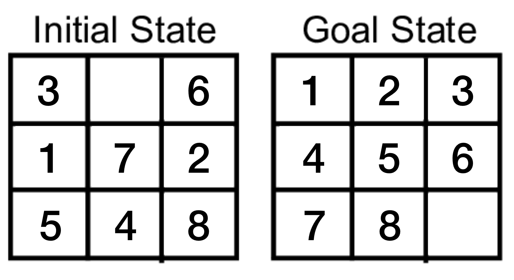

# 8-Puzzle AI Solver

An AI solver for the 8-puzzle game, generalised to puzzle sizes of n-dimensions.

<p align="left">
  
</p>

The AI solver takes any puzzle in a scrambled state, and uses A* search to find a solution.

---

1. [Quickstart](#quickstart)
2. [Files](#files)
3. [Licensing](#licensing)

## Quickstart <a name="quickstart"></a>

**Try the app**

To solve a puzzle board configuration with the AI solver, run the `main.py` file with:

```
python3 main.py -n [n] -b [board] [-p]
```

where `-n` is the size of the puzzle (e.g. a 3x3 puzzle has size 3), `-b` is the starting scrambled board configuration as a list of lists (e.g. `[[5,7,6],[2,4,3],[8,1,0]]`), and `[-p]` is an optional parameter if you want the program to print out the move sequence to reach the solved puzzle. The program will return an error if the board is not configured properly.

**Run tests**

To run tests, run the following while in the home directory.

`python3 -m unittest discover tests`

## Files <a name="files"></a>

The `8_puzzle_solver.ipynb` notebook contains all of the raw code for the AI puzzle solver, as well as some experiments with different heuristic functions.

`solver.py` contains the functions used to solve the puzzle including the A* search protocol, and the different heuristic functions.

`puzzle.py` contains the puzzle class which defines the puzzle object and the different attributes and method to move the puzzle and keep track of the puzzle state.

`tests.py` contains the unit tests to check all of the functions work as expected.

`main.py` is the main program that can be used to solve a puzzle.

## Licensing<a name="licensing"></a>

[LICENSE information](https://github.com/gwpicard/8-puzzle-solver/blob/master/LICENSE)
